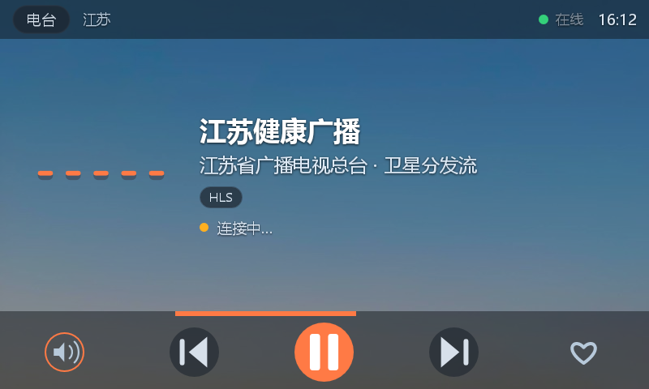
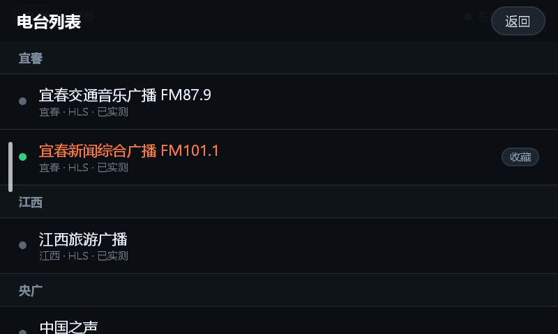
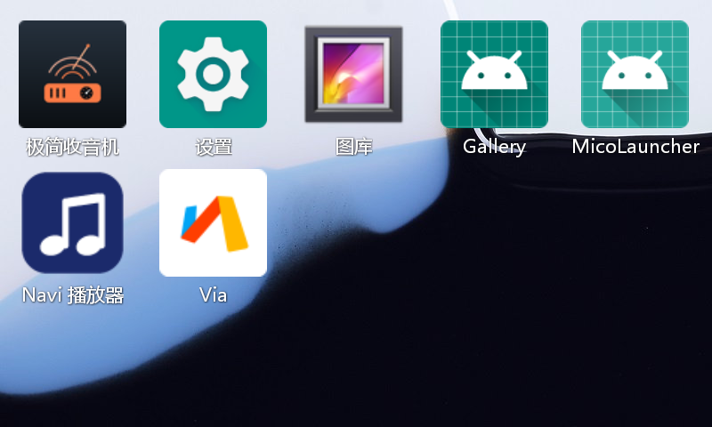

# 极简收音机 · Simple Radio


-green)


**简体中文** | [English](#english)

为小爱触屏音箱 LX04（800×480、Android 8.1、1GB RAM、无返回键）定制的本地网络收音机 App，兼容其他横屏 Android 设备。零第三方依赖、不上报任何数据，APK 不到 100KB。

<p align="center">
  
  
  
</p>

## 特性

- **304 个国内电台，34 个省市分组**（含央广/国际），全部经真机播放验证，支持 HLS(m3u8) 与 HTTP 直连流（MP3/AAC）
- **为触屏音箱而生**：大字体、大按钮、整屏布局，无返回键也能完整操作（长按播放键退出）
- **稳定播放**：音频焦点正确让位/恢复、断流自动重连、HLS 卡顿看门狗
- **纯本机**：无账号、无统计、无遥测；唯一网络行为是拉电台音频流
- **自绘 UI**：波形可视化（WaveView）、自绘图标按钮（IconView）——定制 ROM 缺字体图标也不会变方块
- **不依赖 Gradle**：一条 `python build.py` 完成 aapt2 → javac → d8 → zipalign → apksigner 全链路

## 构建

环境要求：Python 3.8+（仅标准库）、JDK 8+（需 `javac`）、Android SDK（build-tools 与 platforms，34.0.0/android-34 或更高）。

```bash
python build.py          # 产出 build/radio.apk（不存在密钥时会自动生成调试密钥）
adb install -r build/radio.apk
```

SDK/JDK 路径解析顺序：`local.properties`（`sdk.dir=` / `jdk.dir=`）→ 环境变量 `ANDROID_HOME` / `JAVA_HOME` → 默认安装位置。`local.properties` 已被 .gitignore 排除，不会把本机路径提交进仓库。

> 首次构建自动生成的 `radio.jks` 口令为 `android`，仅供本地调试；正式分发请换自己的密钥。

## 电台数据

数据文件：`res/raw/stations.json`（304 台，随 App 打包）。

| 字段 | 说明 |
|------|------|
| `id` | 唯一标识 |
| `name` | 电台名称 |
| `group` | 分组（省市） |
| `url` | 流地址（m3u8 / mp3 / aac） |
| `codec` | 协议类型：`HLS` / `MP3` 等 |
| `desc` | 备注 |
| `verified` | 采集当天真机可播 |

增删电台直接编辑 JSON 即可，无需改代码。

**免责声明**：电台流地址来自公开网络渠道整理，仅供学习研究；内容版权归原作者及电台所有。如流地址侵权或失效，请提 Issue，会及时移除。

## 已知问题

- 在 LX04 的 ROM 上，本应用内系统级“左滑返回桌面”手势不生效（其他应用正常），根因未定位；退出请**长按中间播放键约 1 秒**。
- 网络电台流本身有时效性，`verified` 只代表采集当天可用；个别电台某天失效属正常现象，重进或换台即可。

## 目录结构

```
radioapp/
├── AndroidManifest.xml        # 清单（Fullscreen 横屏，minSdk 24）
├── build.py                   # 一键离线构建脚本（无 Gradle）
├── make_icon.py               # 应用图标生成脚本（PIL）
├── src/com/tongsir/radio/
│   ├── MainActivity.java      # 界面、列表、交互
│   ├── RadioPlayer.java       # MediaPlayer 封装、焦点、重连
│   ├── StationRepo.java       # 电台数据加载
│   ├── Station.java           # 数据模型
│   ├── WaveView.java          # 播放波形动画
│   └── IconView.java          # 自绘图标按钮
├── res/
│   ├── layout/                # 主界面、列表项
│   ├── drawable/              # 背景、滑块等
│   ├── mipmap-*/              # 各密度启动图标
│   └── raw/stations.json      # 304 台电台数据
└── assets/                    # README 截图
```

## License

[MIT](LICENSE) © 2026 DELIX0805

---

<a id="english"></a>
# English

A local Internet-radio app built for the Xiaomi Mi AI Touchscreen Speaker LX04 (800×480, Android 8.1, 1 GB RAM, no back key), also compatible with other landscape Android devices. Zero third-party dependencies, no telemetry, APK under 100 KB.

## Features

- **304 Chinese radio stations in 34 region groups** (incl. CNR/international), all play-verified on real hardware; supports HLS (m3u8) and direct HTTP streams (MP3/AAC)
- **Designed for touchscreen speakers**: large fonts, large buttons, full-screen layout; fully usable without a back key (long-press the play button to exit)
- **Reliable playback**: proper audio-focus handling, auto-reconnect on stream failure, HLS stall watchdog
- **Purely local**: no account, no analytics, no telemetry; the only network traffic is the audio streams themselves
- **Self-drawn UI**: waveform visualization (WaveView) and self-drawn icon buttons (IconView) — no missing-glyph boxes on stripped-down ROMs
- **No Gradle needed**: `python build.py` runs the whole toolchain: aapt2 → javac → d8 → zipalign → apksigner

## Build

Requirements: Python 3.8+ (stdlib only), JDK 8+ (`javac` required), Android SDK (build-tools and platforms, 34.0.0/android-34 or newer).

```bash
python build.py          # produces build/radio.apk (auto-creates a debug keystore if missing)
adb install -r build/radio.apk
```

SDK/JDK resolution order: `local.properties` (`sdk.dir=` / `jdk.dir=`) → environment variables `ANDROID_HOME` / `JAVA_HOME` → default install locations. `local.properties` is git-ignored, so local paths never reach the repository.

> The auto-generated `radio.jks` uses the password `android` — debug use only. Use your own keystore for production.

## Station data

Data file: `res/raw/stations.json` (304 stations, packaged with the app).

| Field | Description |
|-------|-------------|
| `id` | unique id |
| `name` | station name |
| `group` | region group |
| `url` | stream URL (m3u8 / mp3 / aac) |
| `codec` | protocol: `HLS` / `MP3` etc. |
| `desc` | note |
| `verified` | playable on device at collection time |

To add or remove stations, just edit the JSON — no code changes needed.

**Disclaimer**: Stream URLs are collected from public sources for study and research only. All content belongs to the original broadcasters. If a stream infringes your rights or is broken, open an issue and it will be removed promptly.

## Known issues

- On the LX04 ROM, the system-level "swipe left to go home" gesture does not work inside this app (other apps are fine); root cause not yet identified. To exit, **long-press the center play button for ~1 second**.
- Radio streams drift over time; `verified` only means it played on the collection day. A station going offline occasionally is normal — reopen or switch stations.

## License

[MIT](LICENSE) © 2026 DELIX0805
